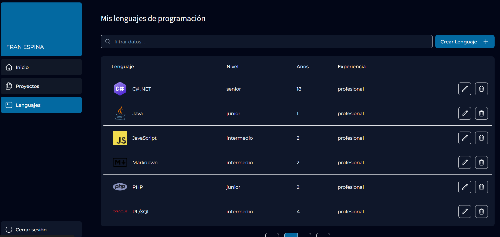
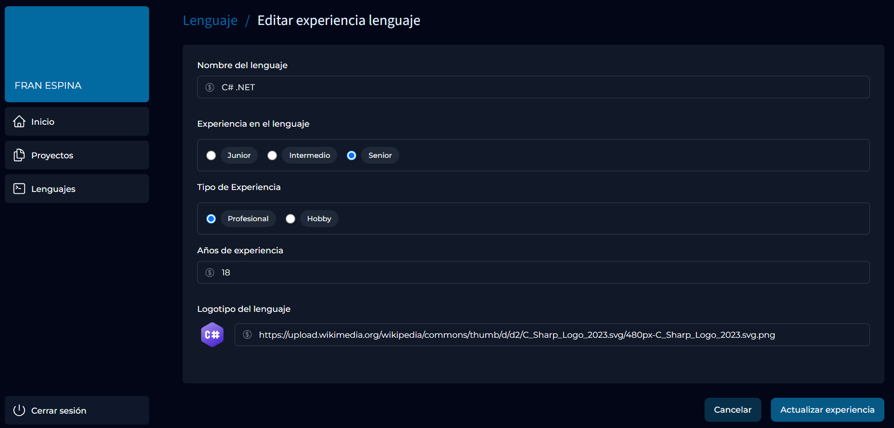

# NextJs - Router + Maestro detalle 
Pruebas con NextJs para la creación de una web con backend y frontend.

Creación de un [CRUD](https://my-projects-seven-phi.vercel.app/dashboard/languages). Desarrollado con TypeScript y estilado con Tailwind. Backend con base de datos en Postgresql.

La aplicación sólo pretende ilustrar como se pueden gestionar enrutado, uso de apis para acceso a datos y un típico CRUD de gestión de un maestro, en este caso de lenguajes de programación usados por el usuario logado.

## Por hacer ...
 - Implementar usuarios y zonas autorizadas
 - Implementar otro crud para crear proyectos y asignar competencias